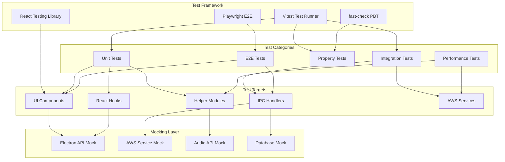

# Design Document: Comprehensive App Testing

## Overview

This design document outlines the testing architecture for Ollie, a desktop voice dictation application. The testing framework is designed to provide comprehensive coverage across UI/UX, usability, performance, integration, and end-to-end scenarios while maximizing automation and minimizing manual testing requirements.

The testing strategy employs a multi-layered approach:
1. **Unit Tests** - Component-level testing with mocked dependencies
2. **Integration Tests** - Cross-component testing with real IPC communication
3. **Property-Based Tests** - Automated verification of universal properties
4. **E2E Tests** - Full workflow validation with mocked AWS services
5. **Performance Tests** - Benchmark validation for latency and resource usage

All tests except final voice input validation will be automated using Vitest, React Testing Library, and Playwright.

## Architecture



## Components and Interfaces

### Test Configuration

```typescript
// vitest.config.ts
interface TestConfig {
  testEnvironment: 'jsdom' | 'node';
  setupFiles: string[];
  coverage: {
    provider: 'v8';
    reporter: ['text', 'html', 'lcov'];
    exclude: string[];
    thresholds: {
      statements: number;
      branches: number;
      functions: number;
      lines: number;
    };
  };
  testTimeout: number;
  globals: boolean;
}
```

### Mock Interfaces

```typescript
// Electron API Mock
interface MockElectronAPI {
  // Window management
  hideWindow: () => Promise<void>;
  showDictationPanel: () => Promise<void>;
  windowMinimize: () => Promise<void>;
  windowClose: () => Promise<void>;
  
  // Hotkey management
  updateHotkey: (key: string) => Promise<{ success: boolean }>;
  onToggleDictation: (callback: () => void) => void;
  
  // Database operations
  saveTranscription: (text: string) => Promise<{ id: number }>;
  getTranscriptions: (limit: number) => Promise<TranscriptionItem[]>;
  deleteTranscription: (id: number) => Promise<{ success: boolean }>;
  clearTranscriptions: () => Promise<{ cleared: number }>;
  
  // Clipboard operations
  pasteText: (text: string) => Promise<void>;
  readClipboard: () => Promise<string>;
  writeClipboard: (text: string) => Promise<void>;
  
  // AWS operations
  streamingTranscribeStart: (options: TranscribeOptions) => Promise<{ success: boolean }>;
  streamingTranscribeChunk: (buffer: ArrayBuffer) => Promise<{ success: boolean }>;
  streamingTranscribeEnd: () => Promise<{ success: boolean; text: string }>;
  invokeBedrock: (params: BedrockParams) => Promise<string>;
  
  // Context detection
  getActiveAppContext: () => Promise<AppContext>;
  
  // Event listeners
  onStreamingPartial: (callback: (data: { text: string }) => void) => void;
  onStreamingFinal: (callback: (data: { text: string }) => void) => void;
  onStreamingLanguage: (callback: (data: { languageCode: string }) => void) => void;
  onStreamingError: (callback: (data: { error: string }) => void) => void;
  removeAllListeners: (channel: string) => void;
}

// AWS Service Mock
interface MockAWSServices {
  transcribe: {
    startSession: (options: TranscribeOptions) => Promise<void>;
    sendChunk: (buffer: Buffer) => void;
    endSession: () => Promise<string>;
    simulatePartialResult: (text: string) => void;
    simulateFinalResult: (text: string) => void;
    simulateLanguageDetection: (code: string) => void;
    simulateError: (error: Error) => void;
  };
  bedrock: {
    invoke: (params: BedrockParams) => Promise<string>;
    simulateTimeout: () => void;
    simulateError: (error: Error) => void;
  };
}

// Audio API Mock
interface MockAudioAPI {
  mediaDevices: {
    getUserMedia: (constraints: MediaStreamConstraints) => Promise<MediaStream>;
    enumerateDevices: () => Promise<MediaDeviceInfo[]>;
  };
  AudioContext: MockAudioContext;
  AudioWorkletNode: MockAudioWorkletNode;
}
```

### Test Utilities

```typescript
// Test factory functions
interface TestFactories {
  createTranscriptionItem: (overrides?: Partial<TranscriptionItem>) => TranscriptionItem;
  createAppContext: (appName: string, bundleId?: string) => AppContext;
  createMockMediaStream: () => MediaStream;
  createMockAudioBuffer: (duration: number) => ArrayBuffer;
}

// Test helpers
interface TestHelpers {
  waitForState: <T>(getter: () => T, expected: T, timeout?: number) => Promise<void>;
  simulateHotkeyPress: (key: string) => void;
  simulateRecordingCycle: (duration: number) => Promise<void>;
  measureExecutionTime: <T>(fn: () => Promise<T>) => Promise<{ result: T; duration: number }>;
}
```

### Component Test Wrappers

```typescript
// Wrapper for testing components with providers
interface TestWrapper {
  render: (component: React.ReactElement, options?: RenderOptions) => RenderResult;
  renderHook: <T>(hook: () => T, options?: RenderHookOptions) => RenderHookResult<T>;
}

interface RenderOptions {
  initialState?: Record<string, unknown>;
  mockElectronAPI?: Partial<MockElectronAPI>;
  mockLocalStorage?: Record<string, string>;
}
```

## Data Models

### Test Data Types

```typescript
// Transcription test data
interface TranscriptionItem {
  id: number;
  text: string;
  timestamp: string;
  duration?: number;
  language?: string;
}

// App context test data
interface AppContext {
  appName: string;
  bundleId: string | null;
  executablePath: string | null;
  windowTitle: string | null;
  platform: 'darwin' | 'win32' | 'linux';
}

// Recording state test data
interface RecordingState {
  isRecording: boolean;
  isProcessing: boolean;
  detectedLanguage: string | null;
  partialTranscript: string;
  finalTranscript: string;
}

// Settings test data
interface SettingsData {
  dictationKey: string;
  transcribeLanguage: string;
  awsRegion: string;
  useTextEnhancement: boolean;
  enhancementModel: string;
  selectedMicrophoneId: string;
  contextAwareEnabled: boolean;
  defaultStyle: 'formal' | 'casual' | 'neutral';
}

// Performance metrics
interface PerformanceMetrics {
  startupTime: number;
  recordingLatency: number;
  transcriptionLatency: number;
  enhancementLatency: number;
  databaseQueryTime: number;
  memoryUsage: number;
}

// Test result types
interface TestResult {
  passed: boolean;
  duration: number;
  error?: Error;
  metrics?: PerformanceMetrics;
}
```

### Generator Types for Property Testing

```typescript
// Arbitrary generators for property-based testing
interface TestGenerators {
  // Text generators
  validTranscriptionText: () => Arbitrary<string>;
  emptyOrWhitespaceText: () => Arbitrary<string>;
  unicodeText: () => Arbitrary<string>;
  
  // Settings generators
  validHotkey: () => Arbitrary<string>;
  validLanguageCode: () => Arbitrary<string>;
  validAwsRegion: () => Arbitrary<string>;
  
  // App context generators
  emailAppContext: () => Arbitrary<AppContext>;
  chatAppContext: () => Arbitrary<AppContext>;
  unknownAppContext: () => Arbitrary<AppContext>;
  
  // Audio data generators
  validAudioBuffer: (duration: number) => Arbitrary<ArrayBuffer>;
  
  // Transcription item generators
  transcriptionItem: () => Arbitrary<TranscriptionItem>;
  transcriptionList: (count: number) => Arbitrary<TranscriptionItem[]>;
}
```


## Correctness Properties

*A property is a characteristic or behavior that should hold true across all valid executions of a system—essentially, a formal statement about what the system should do. Properties serve as the bridge between human-readable specifications and machine-verifiable correctness guarantees.*

The following properties are derived from the acceptance criteria and will be implemented as property-based tests using fast-check.

### Property 1: Language Badge Display

*For any* detected language code from AWS Transcribe, the Dictation_Panel SHALL display a badge containing the uppercase two-letter language prefix (e.g., "EN" for "en-US", "ES" for "es-US").

**Validates: Requirements 1.5**

### Property 2: Transcription List Ordering

*For any* list of transcription items with timestamps, the Control_Panel SHALL display them in descending chronological order (newest first).

**Validates: Requirements 2.3, 11.2**

### Property 3: Transcription Deletion Consistency

*For any* transcription item in the history list, deleting it SHALL result in the item no longer appearing in the list, and the list length SHALL decrease by exactly one.

**Validates: Requirements 2.4, 11.3**

### Property 4: Hotkey Selection UI Update

*For any* valid hotkey character selected in the Onboarding_Flow, the hotkey display SHALL update to show the selected character, and the next button SHALL become enabled.

**Validates: Requirements 3.6**

### Property 5: Settings Persistence Round-Trip

*For any* valid settings configuration (language, region, enhancement toggle, model selection), saving settings and then loading them SHALL return equivalent values.

**Validates: Requirements 4.3, 4.4**

### Property 6: Hotkey Validation

*For any* reserved system key (Escape, Tab, Enter, etc.), the Settings_Modal SHALL reject it as an invalid hotkey selection.

**Validates: Requirements 4.2**

### Property 7: Hotkey Event Emission

*For any* registered hotkey, pressing that key SHALL emit exactly one toggle-dictation event to the renderer process.

**Validates: Requirements 5.2**

### Property 8: Hotkey Update Behavior

*For any* hotkey update from key A to key B, pressing key A SHALL NOT emit events, and pressing key B SHALL emit the toggle-dictation event.

**Validates: Requirements 5.3**

### Property 9: Audio Chunk Streaming

*For any* audio chunk captured during recording, the chunk SHALL be forwarded to the streaming transcription endpoint within the same recording session.

**Validates: Requirements 6.2, 7.2**

### Property 10: Recording State Invariant

*For any* point in time while recording is active (between startRecording and stopRecording/abortRecording), the isRecording state SHALL be true.

**Validates: Requirements 6.6**

### Property 11: Transcription Callback Emission

*For any* partial or final result received from AWS Transcribe, the corresponding callback (onPartialResult or onFinalResult) SHALL be invoked with the transcript text.

**Validates: Requirements 7.3, 7.4**

### Property 12: Transcript Assembly

*For any* streaming transcription session, the final transcript returned by endSession SHALL contain all confirmed (non-partial) segments concatenated in order.

**Validates: Requirements 7.6**

### Property 13: Style Mapping Lookup

*For any* application context, getStyleForApp SHALL return:
- 'formal' for email applications (Mail, Outlook, Gmail)
- 'casual' for chat applications (Slack, Discord, Messages)
- the configured default style for unknown applications

**Validates: Requirements 8.2, 8.3, 8.4, 8.5, 9.1, 9.2, 9.3**

### Property 14: Custom Mapping Persistence

*For any* custom app-to-style mapping added via addCustomMapping, the mapping SHALL be retrievable via getStyleForApp, and removing it SHALL cause getStyleForApp to return the default style.

**Validates: Requirements 9.4, 9.5**

### Property 15: Mapping Serialization Round-Trip

*For any* set of style mappings, exporting them to JSON and then importing the JSON SHALL result in equivalent mappings being available.

**Validates: Requirements 9.6, 9.7**

### Property 16: Database CRUD Operations

*For any* transcription text saved via saveTranscription, the text SHALL be retrievable via getTranscriptions, and deleting it SHALL remove it from future getTranscriptions results.

**Validates: Requirements 10.3, 10.4, 11.1, 11.2, 11.3**

### Property 17: Bedrock Client Caching

*For any* sequence of getBedrockClient calls after warmup, the same client instance SHALL be returned (referential equality).

**Validates: Requirements 12.3**

### Property 18: Toast Content Display

*For any* toast triggered with a title and description, the rendered toast SHALL contain both the title text and description text.

**Validates: Requirements 13.1**

### Property 19: Accessibility Attributes

*For any* interactive element (button, toggle, input) rendered in the application, the element SHALL have appropriate ARIA attributes (aria-label for buttons, aria-pressed for toggles).

**Validates: Requirements 15.1, 15.3, 15.4**

### Property 20: LocalStorage Hook Behavior

*For any* key-value pair stored in localStorage, the useLocalStorage hook SHALL return the stored value, and for non-existent keys, it SHALL return the provided default value.

**Validates: Requirements 17.2, 17.3**

## Error Handling

### Error Categories

| Category | Source | Handling Strategy |
|----------|--------|-------------------|
| Permission Errors | Microphone/Accessibility denied | Display guidance toast, prevent recording |
| AWS Credential Errors | Missing/expired credentials | Display setup guidance, block AWS operations |
| Network Errors | Connection timeout/failure | Display retry option, queue operations |
| Transcription Errors | AWS Transcribe failures | Display error toast, allow retry |
| Enhancement Errors | Bedrock invocation failures | Fall back to original text, log warning |
| Database Errors | SQLite failures | Display error toast, retry operation |
| Hotkey Errors | Registration failures | Display error, suggest alternative key |

### Error Recovery Strategies

```typescript
// Error recovery configuration
interface ErrorRecoveryConfig {
  maxRetries: number;
  retryDelayMs: number;
  fallbackBehavior: 'silent' | 'toast' | 'modal';
  logLevel: 'error' | 'warn' | 'info';
}

const errorRecoveryStrategies: Record<string, ErrorRecoveryConfig> = {
  transcription: {
    maxRetries: 2,
    retryDelayMs: 1000,
    fallbackBehavior: 'toast',
    logLevel: 'error'
  },
  enhancement: {
    maxRetries: 1,
    retryDelayMs: 500,
    fallbackBehavior: 'silent',
    logLevel: 'warn'
  },
  database: {
    maxRetries: 3,
    retryDelayMs: 100,
    fallbackBehavior: 'toast',
    logLevel: 'error'
  },
  network: {
    maxRetries: 3,
    retryDelayMs: 2000,
    fallbackBehavior: 'modal',
    logLevel: 'error'
  }
};
```

### Mock Error Injection

```typescript
// Test utilities for error injection
interface ErrorInjector {
  injectPermissionError: (type: 'microphone' | 'accessibility') => void;
  injectNetworkError: (endpoint: string) => void;
  injectAWSError: (service: 'transcribe' | 'bedrock', errorCode: string) => void;
  injectDatabaseError: (operation: 'read' | 'write' | 'delete') => void;
  clearInjectedErrors: () => void;
}
```

## Testing Strategy

### Test Framework Configuration

The testing framework uses Vitest as the test runner with the following configuration:

```typescript
// vitest.config.ts
export default defineConfig({
  test: {
    environment: 'jsdom',
    globals: true,
    setupFiles: ['./tests/setup.ts'],
    include: ['tests/**/*.test.{ts,tsx}'],
    coverage: {
      provider: 'v8',
      reporter: ['text', 'html', 'lcov'],
      exclude: [
        'node_modules/',
        'tests/',
        '**/*.d.ts',
        'src/dist/',
        'main.js',
        'preload.js'
      ],
      thresholds: {
        statements: 80,
        branches: 75,
        functions: 80,
        lines: 80
      }
    },
    testTimeout: 10000
  }
});
```

### Test Categories and Structure

```
tests/
├── setup.ts                    # Global test setup and mocks
├── mocks/
│   ├── electronAPI.ts          # Electron API mock
│   ├── awsServices.ts          # AWS service mocks
│   ├── audioAPI.ts             # Web Audio API mock
│   └── database.ts             # SQLite mock
├── factories/
│   ├── transcription.ts        # Transcription test data factory
│   ├── appContext.ts           # App context test data factory
│   └── settings.ts             # Settings test data factory
├── generators/
│   └── arbitraries.ts          # fast-check arbitrary generators
├── unit/
│   ├── components/
│   │   ├── App.test.tsx
│   │   ├── ControlPanel.test.tsx
│   │   ├── OnboardingFlow.test.tsx
│   │   ├── SettingsModal.test.tsx
│   │   └── SimpleSettings.test.tsx
│   ├── hooks/
│   │   ├── useAudioRecording.test.ts
│   │   ├── useSettings.test.ts
│   │   ├── useLocalStorage.test.ts
│   │   ├── usePermissions.test.ts
│   │   └── useHotkey.test.ts
│   └── helpers/
│       ├── streamingAudioManager.test.ts
│       ├── styleManager.test.ts
│       └── connectionWarmup.test.ts
├── integration/
│   ├── ipcHandlers.test.ts
│   ├── database.test.ts
│   └── transcription.test.ts
├── property/
│   ├── styleMapping.property.test.ts
│   ├── transcriptionList.property.test.ts
│   ├── settingsPersistence.property.test.ts
│   ├── hotkeyBehavior.property.test.ts
│   ├── databaseCRUD.property.test.ts
│   └── accessibility.property.test.ts
├── performance/
│   ├── startup.perf.test.ts
│   ├── recording.perf.test.ts
│   └── database.perf.test.ts
└── e2e/
    ├── onboarding.e2e.test.ts
    ├── dictation.e2e.test.ts
    └── settings.e2e.test.ts
```

### Dual Testing Approach

**Unit Tests**: Verify specific examples, edge cases, and error conditions
- Focus on component rendering states
- Test hook initialization and state changes
- Verify error handling paths
- Test specific UI interactions

**Property-Based Tests**: Verify universal properties across all inputs
- Use fast-check for property-based testing
- Minimum 100 iterations per property test
- Each property test references its design document property
- Tag format: **Feature: comprehensive-app-testing, Property {number}: {property_text}**

### Property-Based Testing Configuration

```typescript
// Property test configuration
import * as fc from 'fast-check';

const propertyTestConfig: fc.Parameters<unknown> = {
  numRuns: 100,
  verbose: true,
  seed: Date.now(),
  endOnFailure: true
};

// Example property test structure
describe('Feature: comprehensive-app-testing, Property 2: Transcription List Ordering', () => {
  it('should display transcriptions in descending chronological order', () => {
    fc.assert(
      fc.property(
        fc.array(transcriptionItemArbitrary, { minLength: 2, maxLength: 50 }),
        (transcriptions) => {
          const sorted = sortTranscriptions(transcriptions);
          for (let i = 0; i < sorted.length - 1; i++) {
            expect(new Date(sorted[i].timestamp).getTime())
              .toBeGreaterThanOrEqual(new Date(sorted[i + 1].timestamp).getTime());
          }
        }
      ),
      propertyTestConfig
    );
  });
});
```

### Mock Strategy

All AWS services and Electron APIs are mocked for automated testing:

1. **Electron API Mock**: Simulates IPC communication, window management, clipboard operations
2. **AWS Transcribe Mock**: Simulates streaming transcription with configurable responses
3. **AWS Bedrock Mock**: Simulates text enhancement with configurable responses
4. **Audio API Mock**: Simulates MediaDevices and AudioContext for recording tests
5. **Database Mock**: In-memory SQLite for fast database operation tests

### Manual Testing Requirements

Manual testing is only required for:
1. **Actual voice input validation** - Testing real microphone input and speech recognition accuracy
2. **Cross-platform hotkey behavior** - Verifying global hotkey works across different OS versions
3. **Real AWS service integration** - Validating actual AWS Transcribe and Bedrock responses

All other tests are fully automated.
