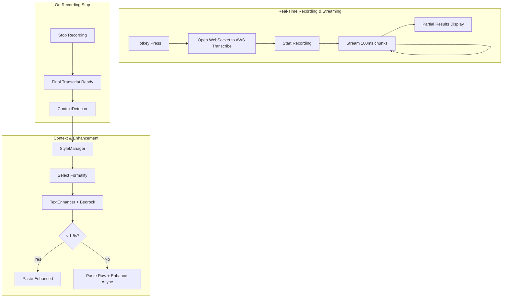

# Design Document: Context-Aware Styling & Speed Optimization

## Overview

This design describes the implementation of real-time streaming transcription, context-aware text styling, and performance optimizations for the Ollie voice dictation app. The primary goal is achieving **sub-2-second end-to-end latency** comparable to Wispr Flow, while adding intelligent context-aware formatting based on the target application.

### Key Design Goals

1. **Speed First**: Entire flow must complete within 2 seconds (down from current 5-8 seconds)
2. **Real-Time Streaming**: Stream audio to AWS Transcribe while recording, not after
3. **Context-Aware**: Detect target app and apply appropriate formality (Formal/Casual/Neutral)
4. **Cross-platform**: Support both macOS and Windows
5. **Graceful Degradation**: If enhancement is slow, paste raw text first

## Architecture

### Current vs New Architecture

**Current (Slow - 5-8 seconds):**
```
Record → Stop → Convert to PCM → Send entire buffer → Wait for transcription → Enhance → Paste
```

**New (Fast - <2 seconds):**
```
Start Recording + Open WebSocket → Stream chunks in real-time → Transcription ready at stop → Quick enhance → Paste
```



### Component Interaction Flow

1. **Hotkey pressed** → Open WebSocket to AWS Transcribe Streaming
2. **Recording starts** → Stream 100ms audio chunks in real-time
3. **During recording** → Display partial transcription results (optional UI feedback)
4. **Recording stops** → Final transcript available within 500ms
5. **Parallel**: ContextDetector identifies active application
6. **StyleManager** resolves app → formality style
7. **TextEnhancer** sends to Bedrock with style prompt
8. **Timeout check**: If >1.5s, paste raw text immediately
9. **Paste** styled text to target application

## Components and Interfaces

### StreamingTranscribeManager (NEW - Critical for Speed)

Handles real-time WebSocket streaming to AWS Transcribe. This replaces the batch-mode transcription.

```typescript
interface TranscriptionCallbacks {
  onPartialResult: (text: string) => void;      // Called during recording
  onFinalResult: (text: string) => void;        // Called when recording stops
  onError: (error: Error) => void;
}

interface StreamingTranscribeManager {
  // Initialize WebSocket connection (call on hotkey press)
  startSession(options: {
    languageCode?: string;  // 'auto' for auto-detect, or specific code
    region?: string;
    credentials?: AWSCredentials;
  }): Promise<void>;
  
  // Stream audio chunk (call every 100ms during recording)
  sendAudioChunk(pcmData: Int16Array): void;
  
  // Signal end of audio stream
  endSession(): Promise<string>;  // Returns final transcript
  
  // Abort session without waiting for result
  abortSession(): void;
  
  // Set callbacks for real-time updates
  setCallbacks(callbacks: TranscriptionCallbacks): void;
  
  // Check if session is active
  isActive(): boolean;
}
```

**Implementation Details:**
```typescript
class StreamingTranscribeManager {
  private socket: WebSocket | null = null;
  private transcriptBuffer: string[] = [];
  
  async startSession(options) {
    // Pre-sign WebSocket URL for AWS Transcribe Streaming
    const url = await this.getPresignedUrl(options);
    
    this.socket = new WebSocket(url);
    this.socket.binaryType = 'arraybuffer';
    
    this.socket.onmessage = (event) => {
      const message = this.decodeMessage(event.data);
      if (message.Transcript?.Results) {
        for (const result of message.Transcript.Results) {
          if (result.IsPartial) {
            this.callbacks?.onPartialResult(result.Alternatives[0].Transcript);
          } else {
            this.transcriptBuffer.push(result.Alternatives[0].Transcript);
          }
        }
      }
    };
  }
  
  sendAudioChunk(pcmData: Int16Array) {
    if (this.socket?.readyState === WebSocket.OPEN) {
      const eventMessage = this.encodeAudioEvent(pcmData);
      this.socket.send(eventMessage);
    }
  }
  
  async endSession(): Promise<string> {
    // Send end-of-stream event
    this.socket?.send(this.encodeEndEvent());
    
    // Wait for final results (with timeout)
    return new Promise((resolve) => {
      setTimeout(() => {
        resolve(this.transcriptBuffer.join(' ').trim());
      }, 500); // Max 500ms wait after stop
    });
  }
}
```

### AudioManager (Refactored for Streaming)

Updated to stream audio in real-time instead of batch processing.

```typescript
interface AudioManagerV2 {
  // Start recording with real-time streaming
  startRecording(): Promise<boolean>;
  
  // Stop recording and get final transcript
  stopRecording(): Promise<{ text: string; duration: number }>;
  
  // Callbacks
  setCallbacks(callbacks: {
    onStateChange: (state: RecordingState) => void;
    onPartialTranscript: (text: string) => void;
    onError: (error: AppError) => void;
    onComplete: (result: TranscriptionResult) => void;
  }): void;
}
```

**Key Changes from Current Implementation:**
1. Open WebSocket to AWS Transcribe when recording starts (not after)
2. Use AudioWorklet for low-latency audio processing
3. Stream PCM chunks every 100ms during recording
4. Transcript is ready within 500ms of stopping (vs 3-5 seconds currently)

```typescript
// Simplified flow
async startRecording() {
  // 1. Open streaming session FIRST
  await this.transcribeManager.startSession({ languageCode: 'auto' });
  
  // 2. Start audio capture with AudioWorklet
  const stream = await navigator.mediaDevices.getUserMedia({ audio: true });
  this.audioContext = new AudioContext({ sampleRate: 16000 });
  
  // 3. Process audio in real-time
  await this.audioContext.audioWorklet.addModule('pcm-processor.js');
  this.workletNode = new AudioWorkletNode(this.audioContext, 'pcm-processor');
  
  this.workletNode.port.onmessage = (event) => {
    // Stream each chunk immediately
    this.transcribeManager.sendAudioChunk(event.data.pcmData);
  };
}
```

### ContextDetector

Responsible for detecting the currently active application using platform-specific APIs.

```typescript
interface AppContext {
  appName: string;           // Human-readable name (e.g., "Slack")
  bundleId?: string;         // macOS bundle identifier (e.g., "com.tinyspeck.slackmacgap")
  executablePath?: string;   // Windows executable path
  windowTitle?: string;      // Current window title
  platform: 'darwin' | 'win32';
}

interface ContextDetector {
  // Detect currently active application
  detectActiveApp(): Promise<AppContext>;
  
  // Check if detection is available on current platform
  isSupported(): boolean;
}
```

**Implementation Notes:**
- macOS: Use Electron's `BrowserWindow.getFocusedWindow()` combined with native module calling `NSWorkspace.shared.frontmostApplication`
- Windows: Use `electron.powerMonitor` events combined with native module calling `GetForegroundWindow()` and `GetWindowThreadProcessId()`
- Fallback: Return unknown context if detection fails

### StyleManager

Manages formality styles and application-to-style mappings.

```typescript
type FormalityStyle = 'formal' | 'casual' | 'neutral';

interface AppMapping {
  id: string;                // Unique identifier
  pattern: string;           // App name or bundle ID pattern (supports wildcards)
  style: FormalityStyle;
  isDefault: boolean;        // Whether this is a system default
}

interface StyleManager {
  // Get style for an application context
  getStyleForApp(context: AppContext): FormalityStyle;
  
  // Get all mappings
  getMappings(): AppMapping[];
  
  // Add custom mapping
  addMapping(pattern: string, style: FormalityStyle): AppMapping;
  
  // Remove mapping
  removeMapping(id: string): boolean;
  
  // Update mapping
  updateMapping(id: string, updates: Partial<AppMapping>): AppMapping;
  
  // Get default style for unmapped apps
  getDefaultStyle(): FormalityStyle;
  
  // Set default style
  setDefaultStyle(style: FormalityStyle): void;
  
  // Reset to system defaults
  resetToDefaults(): void;
}
```

**Default Mappings:**
```typescript
const DEFAULT_MAPPINGS: AppMapping[] = [
  // Email clients → Formal
  { pattern: 'mail', style: 'formal', isDefault: true },
  { pattern: 'outlook', style: 'formal', isDefault: true },
  { pattern: 'gmail', style: 'formal', isDefault: true },
  { pattern: 'com.apple.mail', style: 'formal', isDefault: true },
  { pattern: 'com.microsoft.outlook', style: 'formal', isDefault: true },
  
  // Chat apps → Casual
  { pattern: 'slack', style: 'casual', isDefault: true },
  { pattern: 'discord', style: 'casual', isDefault: true },
  { pattern: 'messages', style: 'casual', isDefault: true },
  { pattern: 'whatsapp', style: 'casual', isDefault: true },
  { pattern: 'telegram', style: 'casual', isDefault: true },
  { pattern: 'com.tinyspeck.slackmacgap', style: 'casual', isDefault: true },
  { pattern: 'com.apple.MobileSMS', style: 'casual', isDefault: true },
];
```

### TextEnhancer

Constructs style-specific prompts and processes text through Bedrock.

```typescript
interface EnhancementResult {
  originalText: string;
  enhancedText: string;
  style: FormalityStyle;
  appContext: AppContext;
  processingTimeMs: number;
}

interface TextEnhancer {
  // Enhance text with context-aware styling
  enhance(text: string, context: AppContext): Promise<EnhancementResult>;
  
  // Get prompt template for a style
  getPromptTemplate(style: FormalityStyle): string;
  
  // Check if enhancement is enabled
  isEnabled(): boolean;
  
  // Enable/disable enhancement
  setEnabled(enabled: boolean): void;
}
```

**Style Prompts:**

```typescript
const STYLE_PROMPTS: Record<FormalityStyle, string> = {
  formal: `You are a professional writing assistant. Clean up the following dictated text:
- Use professional, formal tone
- Use complete sentences with proper grammar
- Avoid contractions (use "do not" instead of "don't")
- Maintain a respectful, business-appropriate style
- Fix any transcription errors
- Do not add information not present in the original

Text: {{text}}

Return only the cleaned text, nothing else.`,

  casual: `You are a friendly writing assistant. Clean up the following dictated text:
- Use a conversational, relaxed tone
- Contractions are fine (don't, can't, won't)
- Keep it natural and approachable
- Fix obvious transcription errors
- Preserve the speaker's personality
- Do not add information not present in the original

Text: {{text}}

Return only the cleaned text, nothing else.`,

  neutral: `You are a writing assistant. Clean up the following dictated text:
- Fix grammar and punctuation errors
- Maintain the original tone and style
- Do not change formality level
- Fix transcription errors only
- Do not add information not present in the original

Text: {{text}}

Return only the cleaned text, nothing else.`
};
```

### SettingsManager (Extended)

Extended to handle context-aware styling settings.

```typescript
interface ContextAwareSettings {
  enabled: boolean;                    // Global toggle
  defaultStyle: FormalityStyle;        // Style for unmapped apps
  customMappings: AppMapping[];        // User-defined mappings
}

interface SettingsManager {
  // Context-aware styling settings
  getContextAwareSettings(): ContextAwareSettings;
  setContextAwareSettings(settings: Partial<ContextAwareSettings>): void;
  
  // Import/export mappings
  exportMappings(): string;  // JSON string
  importMappings(json: string): { success: boolean; imported: number; errors: string[] };
}
```

### IPC Bridge (Main Process)

New IPC handlers for context detection (runs in main process for native API access).

```typescript
// In main.js / preload.js
interface ElectronAPI {
  // Existing methods...
  
  // New context detection methods
  getActiveAppContext(): Promise<AppContext>;
}
```

## Data Models

### Storage Schema

All settings stored in localStorage with the following keys:

```typescript
// Context-aware styling settings
interface StorageSchema {
  'contextAware.enabled': boolean;           // Default: true
  'contextAware.defaultStyle': FormalityStyle; // Default: 'neutral'
  'contextAware.customMappings': string;     // JSON array of AppMapping
}
```

### AppMapping Persistence

```typescript
// Example stored mapping
{
  "id": "custom-1",
  "pattern": "notion",
  "style": "formal",
  "isDefault": false
}
```

### Migration Strategy

For existing users:
1. On first launch after update, check if `contextAware.enabled` exists
2. If not, initialize with defaults:
   - `enabled: true`
   - `defaultStyle: 'neutral'`
   - `customMappings: []`
3. Preserve existing `useTextEnhancement` setting as fallback

## Performance Optimizations

### 1. Connection Pre-warming

Initialize AWS connections on app startup to eliminate cold-start delays:

```typescript
// On app launch
class ConnectionPool {
  private transcribeReady: boolean = false;
  private bedrockReady: boolean = false;
  
  async warmup() {
    // Verify AWS credentials are valid
    const creds = await this.getCredentials();
    
    // Pre-create Bedrock client
    this.bedrockClient = new BedrockRuntimeClient({ 
      region: 'us-east-1',
      credentials: creds 
    });
    
    // Test connection with minimal request
    await this.bedrockClient.send(new ListFoundationModelsCommand({}));
    this.bedrockReady = true;
  }
}
```

### 2. Audio Processing Pipeline

Use AudioWorklet for low-latency audio capture (vs MediaRecorder):

```javascript
// pcm-processor.js - AudioWorklet processor
class PCMProcessor extends AudioWorkletProcessor {
  constructor() {
    super();
    this.buffer = new Float32Array(1600); // 100ms at 16kHz
    this.bufferIndex = 0;
  }
  
  process(inputs) {
    const input = inputs[0][0];
    if (!input) return true;
    
    for (let i = 0; i < input.length; i++) {
      this.buffer[this.bufferIndex++] = input[i];
      
      if (this.bufferIndex >= this.buffer.length) {
        // Convert to Int16 and send
        const pcm = new Int16Array(this.buffer.length);
        for (let j = 0; j < this.buffer.length; j++) {
          pcm[j] = Math.max(-32768, Math.min(32767, this.buffer[j] * 32768));
        }
        this.port.postMessage({ pcmData: pcm });
        this.bufferIndex = 0;
      }
    }
    return true;
  }
}
registerProcessor('pcm-processor', PCMProcessor);
```

### 3. Enhancement Timeout Strategy

Paste raw text if enhancement takes too long:

```typescript
async enhanceWithTimeout(text: string, context: AppContext): Promise<string> {
  const TIMEOUT_MS = 1500;
  
  const enhancePromise = this.textEnhancer.enhance(text, context);
  const timeoutPromise = new Promise<null>((resolve) => 
    setTimeout(() => resolve(null), TIMEOUT_MS)
  );
  
  const result = await Promise.race([enhancePromise, timeoutPromise]);
  
  if (result === null) {
    // Timeout - paste raw text immediately
    await this.paste(text);
    
    // Continue enhancement in background
    enhancePromise.then(enhanced => {
      // Optionally notify user or update clipboard
      console.log('Enhancement completed after paste:', enhanced);
    });
    
    return text;
  }
  
  return result.enhancedText;
}
```

### 4. Latency Budget

| Phase | Target | Current | Notes |
|-------|--------|---------|-------|
| Hotkey → Recording Start | 100ms | ~200ms | Pre-init audio context |
| Audio Streaming | Real-time | N/A (batch) | New WebSocket approach |
| Recording Stop → Transcript | 500ms | 3-5s | Streaming vs batch |
| Context Detection | 50ms | N/A | Parallel with transcription |
| Bedrock Enhancement | 1000ms | 1-2s | Use Haiku, streaming response |
| Paste | 50ms | ~100ms | Already fast |
| **Total** | **<2000ms** | **5-8s** | **4x improvement** |

## File Changes Summary

### New Files
- `src/helpers/streamingTranscribeManager.js` - WebSocket streaming to AWS Transcribe
- `src/helpers/contextDetector.js` - Active app detection
- `src/helpers/styleManager.js` - App-to-style mapping logic
- `src/worklets/pcm-processor.js` - AudioWorklet for low-latency capture

### Modified Files
- `src/helpers/audioManager.js` - Refactor for streaming mode
- `src/services/BedrockService.js` - Add style-specific prompts
- `src/components/SettingsPage.tsx` - Add context-aware styling UI
- `src/components/OnboardingFlow.tsx` - Simplify for AWS-only
- `src/index.css` - AWS AI theme colors
- `main.js` - Add IPC handlers for context detection
- `preload.js` - Expose context detection API

### Deleted Files
- Any OpenAI/local Whisper related code (cleanup)

